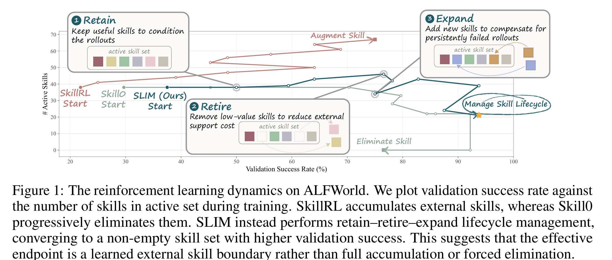
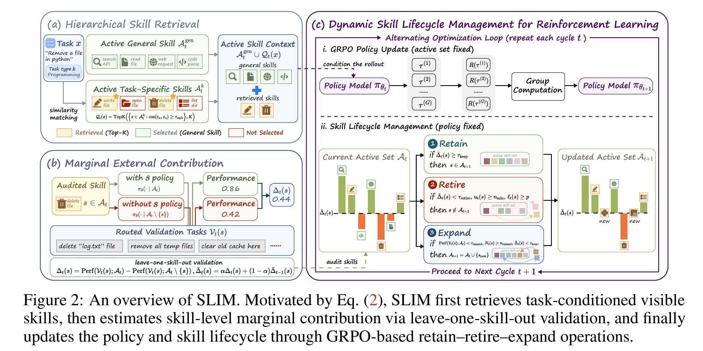
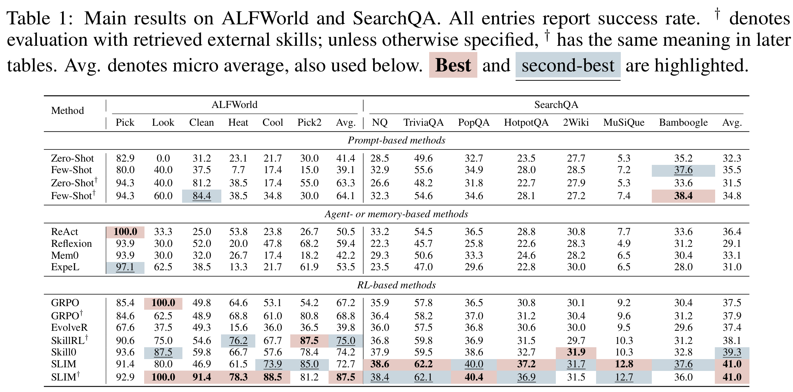

<h1 align="center">
Dynamic Skill Lifecycle Management for Agentic Reinforcement Learning
</h1>

<p align="center">
  <a href="https://arxiv.org/abs/xxxx.xxxxx"></a>
  <a href="https://huggingface.co/papers/xxxx.xxxxx"></a>
  <a href="LICENSE"></a>
</p>

SLIM is a skill-based agent reinforcement learning framework that learns how to
**retain**, **retire**, and **expand** external skills during training. Instead
of assuming that skills should either grow forever or disappear completely, SLIM
keeps a compact active skill set whose composition is driven by validation-time
marginal contribution.

## Overview

<p align="center">
  
</p>

SLIM treats external skills as lifecycle-managed capabilities. For each task,
general skills provide shared guidance, while task-specific skills are retrieved
with embedding similarity from the detected task type.

<p align="center">
  
</p>

At each audit interval, SLIM estimates the marginal external contribution of
routed skills through leave-one-skill-out validation. Skills with stable positive
contribution are retained, skills with negligible contribution after sufficient
exposure are retired, and persistent routed failures can trigger task-specific
skill expansion.

<p align="center">
  
</p>

## News

- `2026-05-11`: Release paper and code.

## Installation

SLIM is intended to run inside the same Docker-style VERL/SGLang runtime used by
the experiments. This release vendors the patched `verl/` trainer used in the
paper experiments, including final `test_after_train` evaluation on
`data.test_files` without lifecycle updates. Follow
[docs/VERL_SETUP.md](docs/VERL_SETUP.md) to create a container from
`verlai/verl:sgl055.latest` and mount the required directories:

```text
/workspace/slim          # this repository
/models                  # base and embedding models
/datasets                # benchmark parquet data and skill banks
```

After the container is running, validate imports as described in
[docs/VERL_SETUP.md](docs/VERL_SETUP.md). The launchers set `PYTHONPATH` so the
vendored SLIM, `agent_system/`, and patched `verl/` are used by default.

## Data Preparation

Use the scripts under `tools/` after entering the configured runtime. The data
layout and skill-bank format are described in [docs/DATA_SETUP.md](docs/DATA_SETUP.md)
and [docs/SKILLBANK_SETUP.md](docs/SKILLBANK_SETUP.md).

ALFWorld:

```bash
cd /workspace/slim
bash tools/prepare_alfworld_runtime.sh
export ALFWORLD_DATA_DIR=/datasets/alfworld_full
bash tools/prepare_alfworld_text_data.sh
```

Search-QA:

```bash
cd /workspace/slim
export SEARCH_QA_DATA_DIR=/datasets/search_qa_processed
export SEARCH_QA_RETRIEVER_DIR=/datasets/search_qa_retriever
bash tools/prepare_search_qa_data.sh
bash tools/prepare_search_qa_retriever.sh
bash tools/check_search_qa_retriever_pool.sh
```

The release also includes initial skill banks under `data/initial_skills/`. You
can use them directly or point `INITIAL_SKILLS` to your own skill bank.

## Training

Create a private env file from the provided templates and fill local paths,
model locations, GPU allocation, and optional skill-creator endpoint:

```bash
cp configs/slim_alfworld.env.example .env.alfworld
cp configs/slim_search_qa.env.example .env.searchqa
```

Run ALFWorld:

```bash
cd /workspace/slim
set -a; source .env.alfworld; set +a
bash scripts/run_alfworld_slim_full.sh
```

Run Search-QA:

```bash
cd /workspace/slim
set -a; source .env.searchqa; set +a
bash scripts/run_search_qa_slim_full.sh
```

The scripts write logs and lifecycle states to `LOG_DIR` and `OUTPUT_DIR` from
the env files. Console logging is the default; set
`TRAINER_LOGGER='[console,wandb]'` to enable WandB. See
[docs/REPRODUCTION.md](docs/REPRODUCTION.md) for the exact script-level
settings.

## Repository Structure

```text
slim_method/      # SLIM retrieval, lifecycle, embedding service, and trainer wrapper
verl/             # Patched VERL trainer used by SLIM, including final test-after-train eval
agent_system/     # Minimal ALFWorld/Search-QA environment and rollout adapters
gigpo/            # Lightweight GiGPO helper dependency used by the vendored trainer
scripts/          # SLIM launch scripts
tools/            # Data preparation and Search-QA retriever utilities
configs/          # Environment-variable templates
docs/             # Additional setup and reproduction notes
data/             # Initial skill banks
```

## Citation

If you find this project useful, please cite:

```bibtex
@article{slim2026shen,
  title  = {Dynamic Skill Lifecycle Management for Agentic Reinforcement Learning},
  author = {Shen, Junhao and Zhang, Teng and Zhao, Xiaoyan and Cheng, Hong}
  year   = {2026},
  journal= {arXiv preprint arXiv:xxxx.xxxxx},
}
```

## Acknowledgement

This project is built on top of and inspired by
[verl-agent](https://github.com/langfengQ/verl-agent),
[veRL](https://github.com/volcengine/verl),
[ALFWorld](https://github.com/alfworld/alfworld),
[SkillRL](https://github.com/aiming-lab/SkillRL),
[Skill0](https://github.com/ZJU-REAL/SkillZero), and
[Search-R1](https://github.com/PeterGriffinJin/Search-R1). We thank the
authors and all project collaborators for their work and support.
